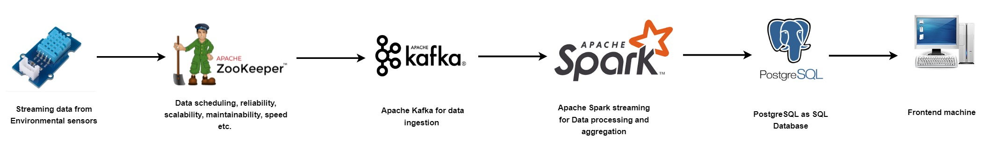

# Real-Time-Environmental-Sensor-Readings-with-Pyspark-Kafka-and-PostgreSQL


## Deployment Instructions for a Standalone Deployment on a Local Machine in a Docker Environment

#### Before you deploy, please ensure you have a stable internet connection to build and download maven packages for the deployment.
#### Also, if you have a local instance of Zookeeper running on port 2181, please consider shutting it down first.
For Linux users, you can do that by running the command systemctl stop <nameofzookeeperinstant>. example
```
systemctl stop zookeeper
```
For Windows users, you need to run the zookeeper-server-stop.bat script.

#### You may now deploy using the following commands:
```
git clone https://github.com/AgyemangOpamobur/Real-Time-Environmental-Sensor-Readings-With-Kafka-Pyspark-and-Postgresql.git 
cd Real-Time-Environmental-Sensor-Readings-With-Kafka-Pyspark-and-Postgresql/producer
```
Unzip iot_telemetry_data.zip
```
unzip iot_telemetry_data.zip -d .
```
Change directory back to the base of the repository and edit the .env_config to provide the environment variable you wish to deploy your application with.
```
cd ..
vi .env_config
``` 
```text
DATABASE_HOSTNAME=
DATABASE_PORT=
DATABASE_PASSWORD=
DATABASE_NAME=
DATABASE_USERNAME=
```
Finally, at the base of the repository, deploy the application by running 

```
docker-compose --env-file .env_config up 
```
or for detach 
```
docker-compose --env-file .env_config up -d
```
To check how your data is published to the Kafka broker open a new terminal and run:
```
docker exec --interactive --tty <kafka container name> kafka-console-consumer.sh --topic temperature_readings --bootstrap-server kafka:9092
```
```text
{"id": "1", "ts": "1595162570", "device": "00:0f:00:70:91:0a", "co": "0", "humidity": "57", "light": "True", "lpg": "0", "motion": "False", "smoke": "0", "temp": "27"}
{"id": "2", "ts": "1594682448", "device": "b8:27:eb:bf:9d:51", "co": "0", "humidity": "72", "light": "False", "lpg": "0", "motion": "False", "smoke": "0", "temp": "20"}
{"id": "3", "ts": "1595013088", "device": "00:0f:00:70:91:0a", "co": "0", "humidity": "62", "light": "False", "lpg": "0", "motion": "False", "smoke": "0", "temp": "22"}
{"id": "4", "ts": "1594850360", "device": "b8:27:eb:bf:9d:51", "co": "0", "humidity": "55", "light": "False", "lpg": "0", "motion": "False", "smoke": "0", "temp": "22"}
{"id": "5", "ts": "1595040990", "device": "1c:bf:ce:15:ec:4d", "co": "0", "humidity": "79", "light": "True", "lpg": "0", "motion": "False", "smoke": "0", "temp": "22"}
{"id": "6", "ts": "1594836724", "device": "b8:27:eb:bf:9d:51", "co": "0", "humidity": "61", "light": "False", "lpg": "0", "motion": "False", "smoke": "0", "temp": "23"}
{"id": "7", "ts": "1594751409", "device": "00:0f:00:70:91:0a", "co": "0", "humidity": "62", "light": "False", "lpg": "0", "motion": "False", "smoke": "0", "temp": "23"}
```
Docker exec into the PostgreSQL database container and run SQL queries  in new terminal 
```
docker exec -ti  <PostgreSQL container name> psql -U <PostgreSQL user> 
```
```text
------------------------------------------
Batch: 1
-------------------------------------------
+---+----------+-----------------+----+--------+-----+----+------+-----+-----+--------------------+
| id|        ts|           device|  co|humidity|light| lpg|motion|smoke| temp|           timestamp|
+---+----------+-----------------+----+--------+-----+----+------+-----+-----+--------------------+
|343|1594666413|00:0f:00:70:91:0a|0.00|   53.00| True|0.00| False| 0.00|24.00|2023-01-25 11:26:...|
|344|1594532169|00:0f:00:70:91:0a|0.00|   48.00| True|0.00| False| 0.00|25.00|2023-01-25 11:26:...|
|345|1594878780|00:0f:00:70:91:0a|0.00|   47.00| True|0.00| False| 0.00|25.00|2023-01-25 11:26:...|
|346|1594524869|00:0f:00:70:91:0a|0.00|   61.00|False|0.00| False| 0.00|24.00|2023-01-25 11:26:...|
|347|1595065390|b8:27:eb:bf:9d:51|0.00|   52.00|False|0.00| False| 0.00|22.00|2023-01-25 11:26:...|
|348|1594955312|b8:27:eb:bf:9d:51|0.00|   54.00|False|0.00| False| 0.00|21.00|2023-01-25 11:26:...|
|349|1594625175|1c:bf:ce:15:ec:4d|0.00|   61.00| True|0.00| False| 0.00|25.00|2023-01-25 11:26:...|
|350|1594639633|b8:27:eb:bf:9d:51|0.00|   60.00| True|0.00| False| 0.00|20.00|2023-01-25 11:26:...|
|351|1595166048|b8:27:eb:bf:9d:51|0.00|   58.00|False|0.00| False| 0.00|18.00|2023-01-25 11:26:...|
|352|1594926363|00:0f:00:70:91:0a|0.00|   69.00|False|0.00| False| 0.00|23.00|2023-01-25 11:26:...|
|353|1594755811|1c:bf:ce:15:ec:4d|0.00|   70.00| True|0.00| False| 0.00|21.00|2023-01-25 11:26:...|
|354|1594802003|00:0f:00:70:91:0a|0.00|   72.00|False|0.00| False| 0.00|18.00|2023-01-25 11:26:...|
|355|1594715184|00:0f:00:70:91:0a|0.00|   69.00| True|0.00| False| 0.00|22.00|2023-01-25 11:26:...|
|356|1594862729|b8:27:eb:bf:9d:51|0.00|   69.00|False|0.00| False| 0.00|20.00|2023-01-25 11:26:...|
|357|1594896309|b8:27:eb:bf:9d:51|0.00|   46.00|False|0.00| False| 0.00|22.00|2023-01-25 11:26:...|
|358|1594874501|b8:27:eb:bf:9d:51|0.00|   57.00|False|0.00| False| 0.00|23.00|2023-01-25 11:26:...|
|359|1594891334|b8:27:eb:bf:9d:51|0.00|   59.00|False|0.00| False| 0.00|21.00|2023-01-25 11:26:...|
|360|1595020102|b8:27:eb:bf:9d:51|0.00|   57.00| True|0.00| False| 0.00|25.00|2023-01-25 11:26:...|
|361|1594972829|1c:bf:ce:15:ec:4d|0.00|   59.00| True|0.00| False| 0.00|26.00|2023-01-25 11:26:...|
|362|1594894671|b8:27:eb:bf:9d:51|0.00|   49.00|False|0.00| False| 0.00|24.00|2023-01-25 11:26:...|
+---+----------+-----------------+----+--------+-----+----+------+-----+-----+--------------------+
only showing top 20 rows

```

